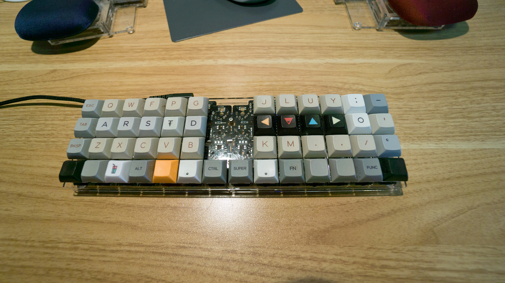
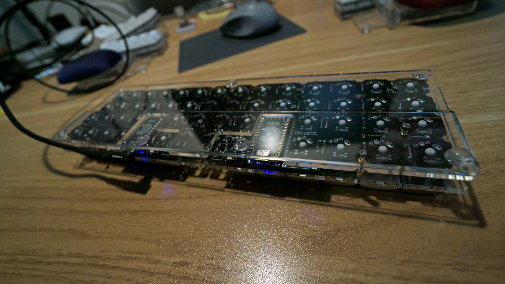

# 4x6plus2
4x6オーソリニア配列のキーボード―に親指用の2つのキーを追加したもの。




# 具材
|項目|説明|URL|
|:--|:--|:--|
|PCB|runner3680|https://github.com/omkbd/Runner3680|
|マイコンボード|Elite-C|https://shop.yushakobo.jp/products/elite-c|
|ケース|自作|https://github.com/hernian/4x6plus2/tree/main/case|
|スペーサー|uxcell スタッドオフスペーサー<br/>M2x6mm 両メス||
|ネジ|六角穴付きボルト<br/>M2x8mm<br/>M2x5mm||
|ゴム足|3Mクッションゴム|
    マイクロUSBのコネクタは捥げ易いので、Type-Cコネクタに拘った。

# ファームウェア
|項目|URL|
|:--|:--|
|QMK|https://github.com/qmk/qmk_firmware|
|キーマップ|https://github.com/hernian/4x6plus2/tree/main/qmk_firmware/keyboards/runner3680/4x7/keymaps/herninan|
|USJP|https://github.com/hernian/4x6plus2/tree/main/qmk_firmware/quantum|

```
USJPとは
PC側は109等の日本語キー配列の設定でありながら、USキー配列風の記号入力にするもの
```
